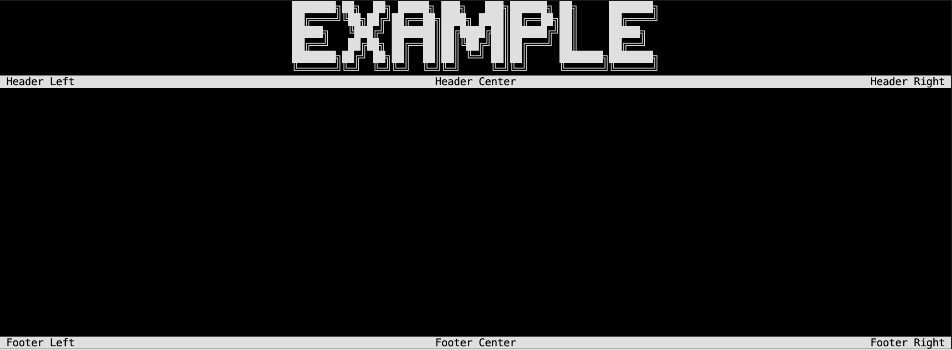
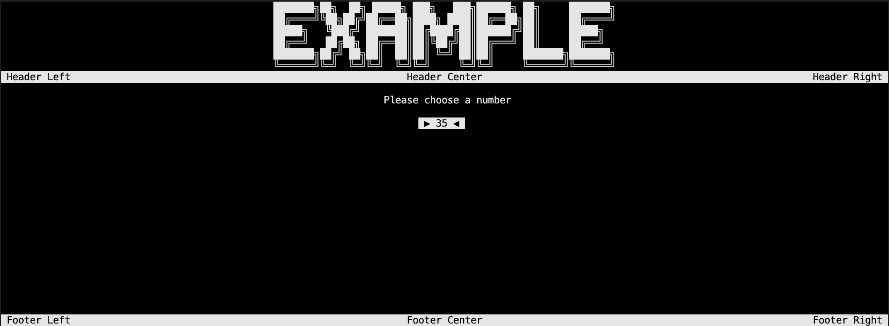
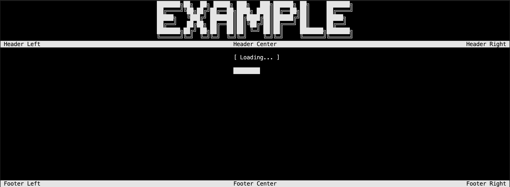
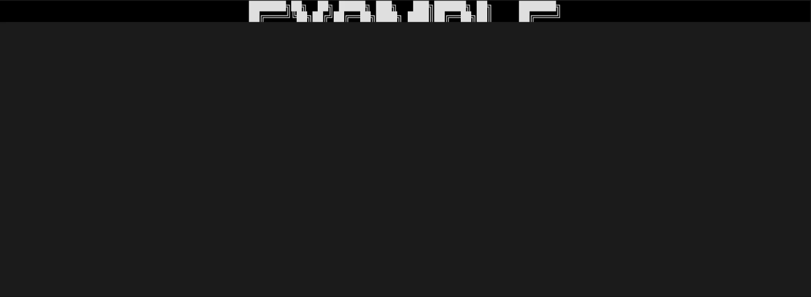

# Usage

> [!TIP]
> Before doing anything, I recommend you to take a quick lookaround to the [source code](https://github.com/MorganKryze/ConsoleAppVisuals) or the [documentation](https://morgankryze.github.io/ConsoleAppVisuals/api/ConsoleAppVisuals.html).

## Getting started

The library is composed of 4 main classes:

```bash
ConsoleAppVisuals
├───Core.cs
├───Extensions.cs
├───Placement.cs
└───Position.cs
```

### Core.cs

This class is the core of the library. It contains the methods to display the different visuals and variables.

### Extensions.cs

This class contains different extensions methods for strings and tuples.

With Position.cs and Placement.cs, it belongs to the tools classes.

### Position.cs

This class is used to define any position defined by an X and Y coordinate. It may be used in cases like matrix selectors for example.

### Placement.cs

This class is used to define the placement of a text in the console. It may be useful to indicate where to place a text in a console, or to define the position of a text in a larger string.

## How to use the library

Most methods of the library are static, so you can use them directly. I recommend importing the library with the following line:

```csharp
using static ConsoleAppVisuals.Core;
```

This way, you can use the methods directly, without having to specify the class name.

> [!NOTE]
> The methods should speak of themselves, but if you need more information, you can take a look at the [documentation](https://morgankryze.github.io/ConsoleAppVisuals/api/ConsoleAppVisuals.Core.html).

Here we will tackle the process and in what way you can make this library useful for you.

### The processes

The process is quite simple. You have to define the different variables you want to display, and then display them according to their methods, then clean the console afterwards.


#### Display a title

By default, no title will be displayed as no file is being targeted. But you can load a file with the `LoadTitle` method and then display it with the `WriteTitle` method.

```csharp
Core.LoadTitle("data/title.example.txt");
Core.WriteTitle();

Console.ReadKey(); //[optional]: just to keep the console clean
```


*Demo with title.example.txt file*

> [!NOTE]
> The file has been added to the project "example" in the root folder if you want to try it.

### Display a banner

Now that we have seen the title, let's see how to display a banner. You may use the default arguments or define your own if you prefer an instant result, specify if you want to display the header or the footer or display your own banner.


```csharp
Core.LoadTitle("data/title.example.txt");
Core.WriteTitle();

Core.WriteBanner();

Console.ReadKey(); //[optional]: just to keep the console clean
```


*Demo with default arguments for the header*

To customize the banner, you can change the arguments or change the default header and footer with the `SetDefaultBanner` method.

```csharp
Core.SetDefaultBanner(("Left", "Top", "Right"));
Core.WriteBanner();

Console.ReadKey();
```


*Demo with custom arguments for the header*

### Write a text in the console

#### Include placement

The `WritePositionneString` method is the most basic method of the library. It allows you to write a string in the console, with the possibility to specify the placement of the string within the width of the console. 

```csharp
Core.LoadTitle("data/title.example.txt");
Core.WriteFullScreen();

Core.WritePositionnedString("On the left", Placement.Left, default, 9, default);
Core.WritePositionnedString("Centered", Placement.Center, default, 10, default);
Core.WritePositionnedString("On the right", Placement.Right, default, 11, default);

Console.ReadKey();
```


*Demo with placed strings*

#### Include continuous printing

In addition to the placement, you can also specify if you want to print the string continuously or not. If you do, the string will be printed character by character, with a delay between each character. You may also interrupt the printing by pressing any key.

```csharp
Core.LoadTitle("data/title.example.txt");
Core.WriteFullScreen();

Core.WriteContinuousString("Hello World! Welcome to this beautiful app.", 10);

Console.ReadKey();
```


#### Include color

You can also specify the color of the elements and choose to apply the negative color to the text. Here are two exampe :

```csharp
Core.LoadTitle("data/title.example.txt");
Core.WriteFullScreen();

Core.ChangeForeground(ConsoleColor.Green);
Core.WritePositionnedString("Hello World! Welcome to this beautiful app.", Placement.Center, false, 10);

Core.ApplyNegative(true);
Core.WritePositionnedString("Press any key to exit.", Placement.Center, true, 12);
Core.ApplyNegative(false);

Console.ReadKey();
```


*Demo with color*

### Clear lines

Based on a line index and a number, you can clean several lines of your console. This is useful if you want to clean a specific part of your console. This way, you can choose to clean only the lines you want, and not the entire console.

```csharp
Core.ClearLine(10); // Clears the line 10
Core.ClearMultipleLines(10, 2); // Clears the lines 10 and 11
Core.ClearContent(); // Clears the space beetween the two banners, header and footer
Core.ClearWindow(); // Clears the whole window with a continuous effect
```

### Special blocks

#### Scrolling menu

The `ScrollingMenuSelector` is a special block that allows you to display a menu with a scrolling effect. You may specify the question and the different choices.

```csharp
Core.LoadTitle("data/title.example.txt");
Core.WriteFullScreen(true);

Core.ScrollingMenuSelector("New question asked ?", default, "Option 1", "Option 2", "Option 3");

Console.ReadKey();
```



#### Number selector

The `ScrollingNumberSelector` is a special block that allows you to display a scrolling element with a number. You may define the minimum and maximum values, the step and the initial value.

```csharp
Core.LoadTitle("data/title.example.txt");
Core.WriteFullScreen(true);

Core.ScrollingNumberSelector("Please choose a number", 10, 50, 25, 5);

Console.ReadKey();
```


*Demo with number selector*

#### Loading bar

The `LoadingBar` is a special block that allows you to display a loading bar. You may define the text to display while loading.

```csharp
Core.LoadTitle("data/title.example.txt");
Core.WriteFullScreen(true);

Core.LoadingBar();

Console.ReadKey();
```


*Demo with loading bar*

#### Lawful loading bar

The `ProcessLoadingBar` is a special block that allows you to display a loading bar with a text and a *true* loading bar. You may define the text to display while loading.

```csharp
Core.LoadTitle("data/title.example.txt");
Core.WriteFullScreen(true);

var percentage = 0f;
var t_Loading = new Thread(() => Core.ProcessLoadingBar("[Lawful loading...]",ref percentage)); // Create a Thread to run the loading bar on the console
t_Loading.Start(); 
while (percentage <= 1f)
{
    Thread.Sleep(100);
    percentage += 0.1f; // Simulate a loading process
}
t_Loading.Join(); // Wait for the Thread to finish

Console.ReadKey();
```


*Demo with lawful loading bar*

### Exit

Last but no least, to exit the application, you can use the `ExitProgram` method. It will display a message and exit the application.

```csharp
Core.LoadTitle("data/title.example.txt");
Core.WriteFullScreen(true);

Core.ExitProgram();

Console.ReadKey();
```

