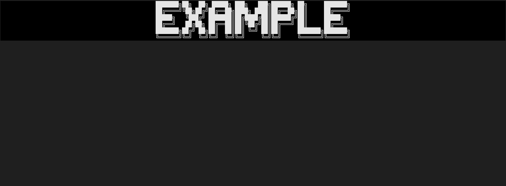
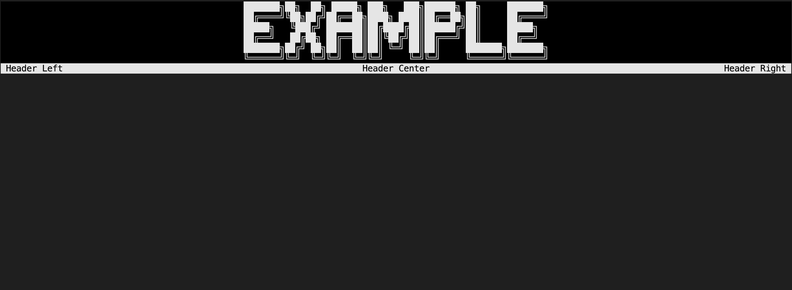

# Usage

> [!TIP]
> Before doing anything, I recommend you to take a quick lookaround to the [source code](https://github.com/MorganKryze/ConsoleAppVisuals) or the [documentation](https://morgankryze.github.io/ConsoleAppVisuals/api/ConsoleAppVisuals.html).

## Getting started

The library is composed of 4 main classes:

```bash
ConsoleAppVisuals
├───Core.cs
├───Extensions.cs
├───Placement.cs
└───Position.cs
```

### Core.cs

This class is the core of the library. It contains the methods to display the different visuals and variables.

### Extensions.cs

This class contains different extensions methods for strings and tuples.

With Position.cs and Placement.cs, it belongs to the tools classes.

### Position.cs

This class is used to define any position defined by an X and Y coordinate. It may be used in cases like matrix selectors for example.

### Placement.cs

This class is used to define the placement of a text in the console. It may be useful to indicate where to place a text in a console, or to define the position of a text in a larger string.

## How to use the library

Most methods of the library are static, so you can use them directly. I recommend importing the library with the following line:

```csharp
using static ConsoleAppVisuals.Core;
```

This way, you can use the methods directly, without having to specify the class name.

> [!NOTE]
> The methods should speak of themselves, but if you need more information, you can take a look at the [documentation](https://morgankryze.github.io/ConsoleAppVisuals/api/ConsoleAppVisuals.Core.html).

Here we will tackle the process and in what way you can make this library useful for you.

### The processes

The process is quite simple. You have to define the different variables you want to display, and then display them according to their methods, then clean the console afterwards.


#### Display a title

By default, no title will be displayed as no file is being targeted. But you can load a file with the `LoadTitle` method and then display it with the `WriteTitle` method.

```csharp
Core.LoadTitle("data/title.example.txt");
Core.WriteTitle();
Console.ReadKey(); //[optional]: just to keep the console clean
```


*Demo with title.example.txt file*

> [!NOTE]
> The file has been added to the project "example" in the root folder if you want to try it.

### Display a banner

Now that we have seen the title, let's see how to display a banner. You may use the default arguments or define your own if you prefer an instant result, specify if you want to display the header or the footer or display your own banner.


```csharp
Core.WriteBanner();
Console.ReadKey(); //[optional]: just to keep the console clean
```


*Demo with default arguments for the header*

To customize the banner, you can change the arguments or change the default header and footer with the `SetDefaultBanner` method.

```csharp
Core.SetDefaultBanner(("Left", "Top", "Right"));
Core.WriteBanner();
Console.ReadKey();
```


*Demo with custom arguments for the header*


