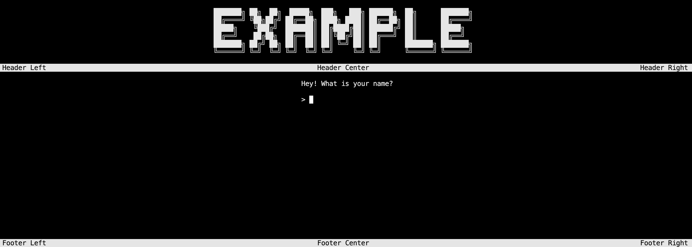
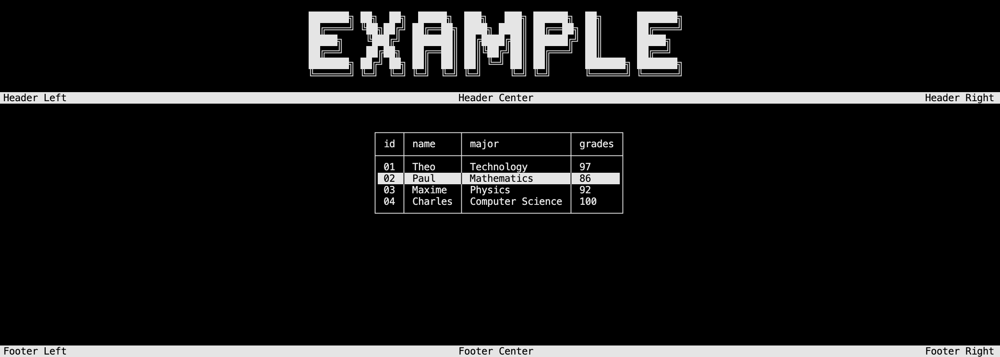
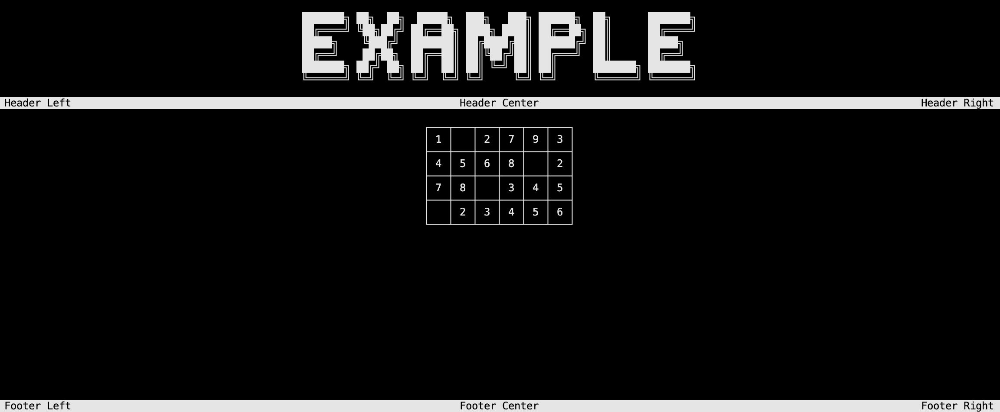
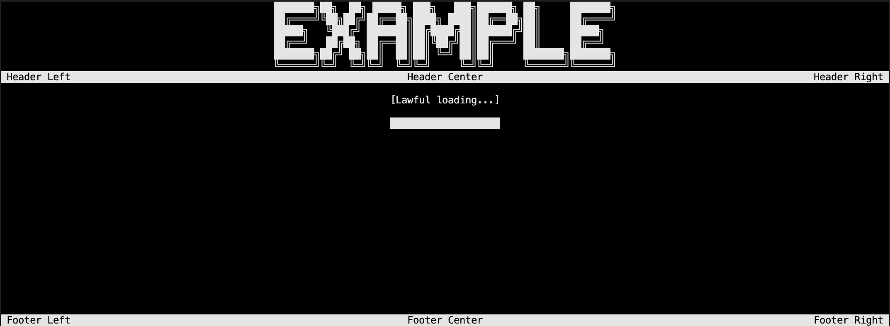

# Specific methods

## Scrolling menu

The `ScrollingMenuSelector` is a special block that allows you to display a menu with a scrolling effect. You may specify the question and the different choices.

```csharp
Core.WriteFullScreen("Example", true);

Core.ScrollingMenuSelector("New question asked ?", default, default, "Option 1", "Option 2", "Option 3");

Console.ReadKey();
```


*Demo with scrolling menu*

> [!NOTE]
> To get the selected option and the key input, refer to the example project.

## Number selector

The `ScrollingNumberSelector` is a special block that allows you to display a scrolling element with a number. You may define the minimum and maximum values, the step and the initial value.

```csharp
Core.WriteFullScreen("Example", true);

Core.ScrollingNumberSelector("Please choose a number", 10, 50, 25, 5);

Console.ReadKey();
```


*Demo with number selector*

> [!NOTE]
> To get the selected option and the key input, refer to the example project.

## Prompt

The `WritePrompt` let you ask a prompt to the user and get the input. You may define the question and the default value.

```csharp
Core.WriteFullScreen("Example", true);

Core.WritePrompt("Is your name John Doe ?", "John Doe");

Console.ReadKey();
```


*Demo with prompt*

## Table selector

First, you need to create a `Table` object giving the lines and optionally the headers just as in the example below.

```csharp
List<string> headers = new () {"id", "name", "major", "grades"};
List<string> student1 = new () {"01", "Theo", "Technology", "97"};
List<string> student2 = new () {"02", "Paul", "Mathematics", "86"};
List<string> student3 = new () {"03", "Maxime", "Physics", "92"};
List<string> student4 = new () {"04", "Charles", "Computer Science", "100"};
Table<string> students = new (headers, new () {student1, student2, student3, student4});
```

The `ScrollingTableSelector` is a special block that allows you to display the table with a selector.

```csharp
students.ScrollingTableSelector(true, false, "Add student");
```


*Demo with table selector*

> [!NOTE]
> Once you created the table, you can add, remove or update the data using the methods provided by the `Table` class (`AddLine`, `RemoveLine`, `UpdateLine`).

Here is an example of a table of how to use them:

```csharp
students.AddLine(new () {"05", "John", "Biology", "95"});
students.RemoveLine(4);
students.UpdateLine(3, new () {"04", "Charles", "Computer Science", "55"});
```

You may also use the `SetRoundedCorners` method to set the rounded corners to true or false for the tables.

```csharp
students.SetRoundedCorners(true);
```

## Matrix display

First, you need to create a `Matrix` object giving the data just as in the example below.

```csharp
List<int?> firstRow = new() { 1, null, 2, 7, 9, 3 };
List<int?> secondRow = new() { 4, 5, 6, 8, null, 2 };
List<int?> thirdRow = new() { 7, 8, null, 3, 4, 5 };
List<int?> fourthRow = new() { null, 2, 3, 4, 5, 6 };
List<List<int?>> data = new() { firstRow, secondRow, thirdRow, fourthRow };
Matrix<int?> matrix = new(data);
```

The `WriteMatrix` is a special block that allows you to display the matrix. This is only visual, you can't select any element.

```csharp
matrix.WriteMatrix(Placement.Center);

Console.ReadKey();
```



> [!NOTE]
> Once you created the matrix, you can add, remove or update the lines using the methods provided by the `Matrix` class (`AddLine`, `RemoveLine`, `UpdateLine`) but also the elements using the `RemoveElement` and `UpdateElement` methods.

Here is an example of a matrix of how to use them:

```csharp

matrix.AddLine(new () {2, 5, 7, 9, 3, 6});
matrix.RemoveLine(3);
matrix.UpdateLine(2, new () {3, 6, 8, 9, null, 2});
matrix.RemoveElement(new Position(2, 2));
matrix.UpdateElement(new Position(3,1), 7);
```

You may also use the `SetRoundedCorners` method to set the rounded corners to true or false for the matrix.

```csharp
matrix.SetRoundedCorners(true);
```

## Loading bar

The `LoadingBar` is a special block that allows you to display a loading bar. You may define the text to display while loading.

```csharp
Core.WriteFullScreen("Example", true);

Core.LoadingBar();

Console.ReadKey();
```


*Demo with loading bar*

## Lawful loading bar

The `ProcessLoadingBar` is a special block that allows you to display a loading bar with a text and a *true* loading bar. You may define the text to display while loading.

```csharp
Core.WriteFullScreen("Example", true);

var percentage = 0f;
var t_Loading = new Thread(() => Core.ProcessLoadingBar("[Lawful loading...]",ref percentage)); // Create a Thread to run the loading bar on the console
t_Loading.Start(); 
while (percentage <= 1f)
{
    Thread.Sleep(100);
    percentage += 0.1f; // Simulate a loading process
}
t_Loading.Join(); // Wait for the Thread to finish

Console.ReadKey();
```


*Demo with lawful loading bar*

## Exit

Last but no least, to exit the application, you can use the `ExitProgram` method. It will display a message and exit the application.

```csharp
Core.WriteFullScreen("Example", true);

Core.ExitProgram();

Console.ReadKey();
```


*Demo with exit message*
